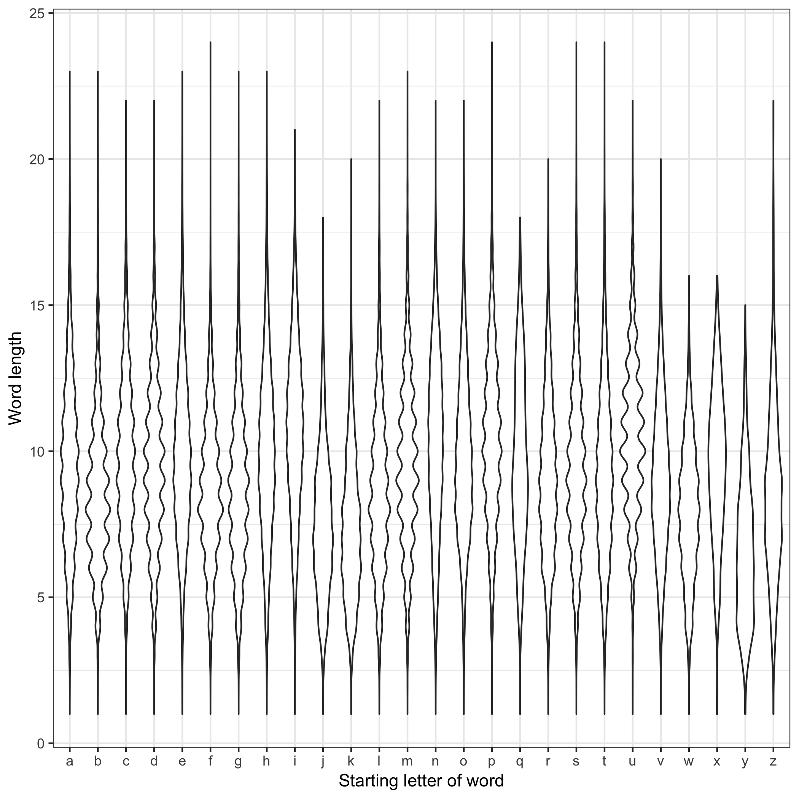

For this homework assignment I determined the length of each word but also wanted to see if that differed by the starting letter of each word.

To visualize this I used violin plots of the length of the words by each starting letter.

